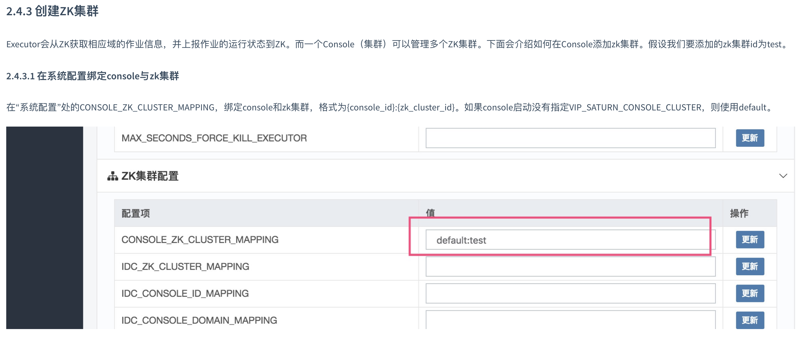

## saturn-plugin
- use `mvn saturn:run` to start executor
- use `mvn clean install` or `mvn saturn:zip` to pack the project

saturn官方地址：https://vipshop.github.io/Saturn/#/

> 本示例用于集成Spring Cloud Alibaba、Nacos

### 版本信息：
- Spring Boot: 1.5.16.RELEASE
- Spring Cloud: Edgware.SR6
- Spring Cloud Alibaba: 1.5.1
- Saturn: 3.5.1

# 操作命令

## 本地执行

本地运行时，需要下载[Executor Zip File](https://github.com/vipshop/Saturn/releases/tag/v3.5.1).

将`saturn-executor-3.5.1-zip.zip`压缩包直接放在maven仓库的saturn-executor文件夹下。如`xxx/.m2/repository/com/vip/saturn/saturn-executor/3.5.1/`

注意网卡名必须是：eth0或者bond0。自己修改源代码再编译打包除外。

本地执行可在IntelliJ IDEA Maven的Command Line配置该命令，需提前搭建好saturn。
在使用Maven的Command Line配置该命令时，下面命令也可不写mvn
```
mvn saturn:run -X -Dnamespace=www.abc.com -DexecutorName=exe01 -DVIP_SATURN_CONSOLE_URI=http://192.168.2.27:9088 -Dans.namespace=6beacc0e-4bfd-4e61-9c74-1cecafee3288
```

> + -Dans.namespace 用于解决nacos和saturn对于namespace JVM系统变量冲突问题
> + -Dans.namespace 可以使nacos client避免读取System.getProperty("namespace")
> + 注意：executor name，默认是hostname；jmx端口默认是24501

## 打包命令

```
mvn clean saturn:zip
```

- 最后部署到服务器执行时，先在IDEA配置好Maven saturn:run命令，然后再打包命令就可，然后将`target`文件夹内的`*-app.zip`文件传到与`saturn-exector-{version}`文件夹所在的平级目录下进行解压即可。
目录展示
```text
saturn-executor-{version}
    -/bin
    -/demo_script
    -/lib
    -/logs
    -saturn-executor.jar
app
    -/lib
      - abc.jar
      - xyz.jar
```
- 然后需要重启saturn-executor才能扫描到新上传文件的内容（Executor启动时会扫描这个app目录，并加载这个目录下（含子目录)所有的jar包。）

⚠️

1、如果遇到`分配分片`没有分配的话，请到`系统配置`->`Console配置`->`ZK集群配置`检查`CONSOLE_ZK_CLUSTER_MAPPING`的配置。
如果console启动没有指定VIP_SATURN_CONSOLE_CLUSTER，则使用default。test为zk id

官方说明：


2、无法注册到nacos的问题，解决来自https://github.com/vipshop/Saturn/issues/645

3、saturn_console启动如果遇到jmx端口冲突，导致无法启动，请更改启动console的脚本，增加`-jmx 24502`参数，jmx端口默认是24501

额外：

Console集群配置VIP_SATURN_CONSOLE_CLUSTER，自己指定，只是一个集群标识而已。

`export VIP_SATURN_CONSOLE_CLUSTER=saturnTest`
